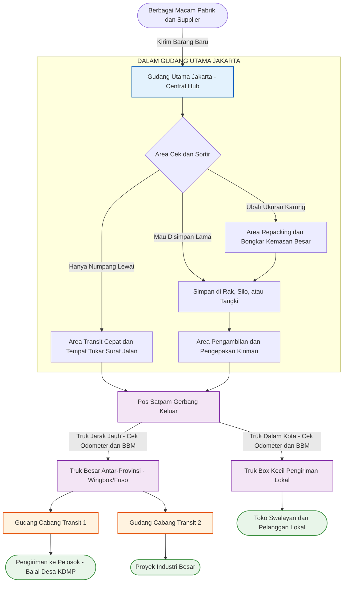

# 01_Business_Overview.md

**Dokumen:** Gambaran Umum Bisnis & Kemampuan Sistem WMS Simple  
**Prinsip Utama:** Satu Mesin Gudang Serba Bisa Untuk Semua Jenis Barang (Universal WMS)  
**Target Industri:** Logistik Truk (Trucking), Distribusi 3PL, Grosir Makanan/Minuman (FMCG), Barang Berat/Curah, Proyek Pengadaan Pemerintah (misal: KDMP)  
**Versi:** 2.4.0 (Simplified Logistics Jargon)  
**Status:** DOKUMEN ACUAN UTAMA  

---

## 1. Filosofi Inti: Satu Sistem Gudang, Beragam Jenis Barang (Universal WMS)

**WMS Simple Enterprise** dibangun sejak awal agar **Gak Kaku Cuma Buat Satu Jenis Usaha**. Sistem ini ibarat "Mesin Gudang Serba Bisa" yang sanggup menangani berbagai gaya kerja logistik modern:

- **Barang Eceran & Kardusan (Retail / FMCG):** Barang elektronik, mie instan, makanan kemasan (Bisa scan barcode, hitung kardus, simpan sistem antrean FIFO/Barang lama keluar duluan).
- **Barang Berat & Jumbo (Bulky / Heavy Lift):** Semen kantong besar 1 Ton (Jumbo Bag), Pipa baja, Gulungan plat, yang butuh penanganan khusus pakai Forklift besar.
- **Barang Curah (Kering / Cair):** Gula curah, beras silo, atau Minyak Kelapa Sawit (CPO) di dalam tangki, yang timbangannya langsung pakai **Timbangan Truk (Weighbridge)**.
- **Peralatan Khusus & Elektronik Pendingin:** Menangani distribusi Showcase dan Kulkas Chiller (seperti proyek Desa KDMP) yang punya aturan ketat: **Wajib Berdiri (Pantang Miring/Ditidurkan)**, wajib catat Nomor Seri Mesin, wajib didiamkan 4 jam setelah turun truk, dan kirim wajib pakai Truk Hidrolik (Tail-Lift).
- **Distribusi Antar-Cabang (Cross-Dock & 3PL):** Barang tidak perlu nginap lama di gudang. Turun dari truk luar kota, langsung geser ke truk kecil pengiriman dalam kota, sekalian **Tukar Surat Jalan** (Biar nama supplier asli tetap rahasia).

---

## 2. Tabel Perbandingan Penanganan Barang (Satu Sistem, Beda Cara Kerja)

Sistem akan otomatis menyesuaikan diri tergantung dari "Aturan Profil Barang" yang diatur di Master Data.

| Alur Kerja Gudang | Kargo Biasa / Kardusan (Sembako, Elektronik, Retail) | Kargo Berat & Curah (Semen, Beras, Minyak, Pupuk) | Barang Proyek Khusus (Showcase / Kulkas Pendingin) |
|---|---|---|---|
| **Terima Barang (Inbound)** | Admin scan barcode barang & hitung jumlah kardus di area bongkar (Dock). | Sopir timbang seluruh bodi truk di Jembatan Timbang (Truk Penuh vs Truk Kosong). | Admin ngecek fisik kaca kulkas utuh atau retak + Scan Barcode **Nomor Seri Mesin**. |
| **Simpan Barang (Storage)** | Disusun rapi di Rak Susun (Aisle/Bay/Bin). | Dituang ke Tabung Silo Kering / Tangki Cairan / Tumpukan lantai (Bunker). | Ditaruh di area lantai khusus, **Wajib Berdiri Tegak & Dilarang Ditumpuk**. |
| **Bongkar Kemasan (Repacking)** | Paket besar dibongkar, lalu dirakit ulang (*Kitting*). | **Proses Curah (De-bulking):** Karung 1 Ton dipecah ke karung kecil 25kg + Sistem otomatis ngitung berapa susutnya (KG hilang). | Pasang Aksesoris, tempel Stiker Aset Negara (BMN) / Stiker Koperasi Desa. |
| **Ganti Dokumen Jalan** | Pecah satu DO besar pabrik menjadi banyak Surat Jalan ke toko-toko kecil. | Cetak Surat Timbang / Surat Pengantar Barang Curah. | **Tukar Dokumen (Blind Shipping):** Ganti Surat Jalan asli pakai form Surat Tanda Terima (BAST) untuk diserahkan ke Kepala Desa. |
| **Truk Keluar Pos Satpam** | Satpam minta Surat Jalan, cek KM Odometer truk, & sisa bensin (BBM). | Satpam minta Surat Timbang, cek Odometer & BBM. | Satpam minta BAST Resmi, cek Odometer & **Pastikan Truk Pakai Pintu Hidrolik (Tail-Lift)**. |
| **Bukti Kirim di Tujuan (e-POD)** | Penerima Tanda Tangan di Layar HP Sopir + Sopir foto paket tiba. | Pabrik/Pembeli serahkan Surat Timbang Penerimaan. | Tanda Tangan Digital Kepala Desa + **Foto Lokasi pakai titik GPS (Cegah alamat fiktif)**. |

---

## 3. Skema Jaringan Gudang (Topologi Hub & Spoke)

Ini adalah cara kerja perpindahan barang dari Supplier hingga sampai ke tangan Pelanggan/Toko/Balai Desa.

