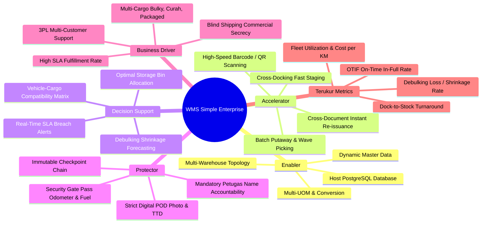

# 01_Strategic_Framework_and_6_Pillars.md

**Document:** WMS Simple Strategic Framework & Technology Decision  
**Target Audience:** Management, Solutions Architect, Operations Head  
**Version:** 2.0.0  
**Status:** ACTIVE  

---

## 1. Kerangka Strategis 6 Pilar (The 6-Pillar Framework)

Sistem WMS Simple dirancang bukan hanya sebagai pencatat administrasi stok, melainkan sebagai mesin operasional logistik terpadu yang bertumpu pada **6 Pilar Fundamental**:

### 1.1 Rincian 6 Pilar
1. **ENABLER (Pemberdaya Fondasi):**
   - Menyediakan fondasi master data yang dinamis dan fleksibel (tipe kargo, kemasan, UOM, jenis armada, tipe dokumen).
   - Arsitektur database terpusat di host PostgreSQL (`wms_simple_db`) untuk efisiensi resource dan kemudahan migrasi ke lingkungan produksi.
2. **ACCELERATOR (Pemercepat Aliran Barang):**
   - Alur *Cross-Docking* yang memotong waktu simpan barang transit < 24 jam.
   - Fitur *Cross-Document* untuk menerbitkan ulang Surat Jalan (SJ) atau Sub-AWB secara instan tanpa input ulang manual.
3. **DECISION SUPPORT (Pendukung Keputusan Operasional):**
   - Validasi otomatis daya muat armada (kapasitas berat kg & volume CBM) terhadap jenis barang.
   - Peringatan dini jika penyusutan de-bulking (*shrinkage loss*) melebihi batas toleransi yang ditetapkan.
4. **PROTECTOR (Pelindung Aset & Kepatuhan):**
   - Modul *Pencatatan Armada Keluar (Fleet Exit Log)* di pos satpam gerbang untuk mencegah kebocoran armada dan BBM.
   - *Immutable Checkpoint Chain* (rantai log audit berantai) dan *Mandatory Petugas Name* untuk menjamin akuntabilitas tanpa celah lempar tanggung jawab.
5. **BUSINESS DRIVER (Penggerak Nilai Komersial):**
   - Memampukan perusahaan melayani berbagai jenis komoditas: barang reguler kardus, barang berat/bulky (*heavy lift*), hingga komoditas curah kering (*dry bulk*) dan curah cair (*liquid bulk*).
   - Fitur *Blind Shipping* pada Cross-Document menjaga kerahasiaan hubungan supplier dengan pelanggan akhir dalam bisnis 3PL.
6. **TERUKUR (Measurable Metrics & KPI):**
   - Sistem menyediakan metrik terukur untuk evaluasi harian:
     - **OTIF (On-Time In-Full) Rate:** % pesanan terkirim tepat waktu dan lengkap.
     - **Dock-to-Stock Time:** Durasi penerimaan PO hingga masuk rak/staging.
     - **Fleet Turnaround Time & Fuel Efficiency:** KM tempuh per liter BBM dan waktu utilisasi armada.
     - **Shrinkage Rate (%):** Persentase susut pada proses de-bulking / pencurahan.

---

## 2. Analisis Teknis: Mengapa Memilih Backend Hono?

Pemilihan framework backend **Hono** (Node.js/TypeScript) didasarkan pada pertimbangan performa, efisiensi resource, dan arsitektur modern:

### 2.1 Matriks Komparasi Backend Framework

| Kriteria | Hono (Node / TS) | Express.js | Fastify | NestJS | Go (Fiber/Gin) |
|---|:---:|:---:|:---:|:---:|:---:|
| **Memory Footprint** | **~25 MB RAM** | ~80 MB RAM | ~50 MB RAM | ~150 MB+ RAM | ~15 MB RAM |
| **Startup Time** | **< 10 ms** | ~200 ms | ~150 ms | ~1.500 ms | < 5 ms |
| **Throughput (Req/sec)** | **Sangat Tinggi (RegExpRouter)** | Rendah - Sedang | Sangat Tinggi | Sedang (Overhead DI) | Sangat Tinggi |
| **Native TypeScript** | **100% First-Class** | Via @types eksternal | Bagus | First-Class | N/A (Bahasa Go) |
| **Standard Web API** | **Fetch/Request/Response Web API** | Legacy Node HTTP (req, res) | Kustom plugin | Express/Fastify adapter | Kustom |
| **Type-Safe RPC Sharing** | **Native Hono Client ke Frontend** | Manual (tRPC / Swagger) | Manual | Swagger Generator | Protobuf / OpenAPI |
| **Kesesuaian di Gudang (IoT & Barcode)** | **Sangat Responsif (< 2ms per request)** | Latency bertambah saat beban tinggi | Cepat | Berat untuk micro-service | Sangat Cepat |

### 2.2 Alasan Utama Penggunaan Hono
1. **Ultra-Ringan & Bebas Overhead Berat:** WMS sering kali melayani ribuan request serentak dari handheld barcode scanner, sensor jembatan timbang, dan mobile gate pass pos satpam. Hono memiliki router tercepat tanpa tumpukan middleware usang.
2. **Type Safety End-to-End dengan Nuxt 3:** Dengan Hono RPC, tipe skema data backend dapat di-import langsung oleh Nuxt 3 di frontend tanpa perlu proses *code generation* yang rawan *desync*.
3. **Universal Deployment Target:** Kode Hono kompatibel berjalan di Node.js host machine, Docker container, maupun Edge server tanpa refactoring.
4. **Modular & Framework-Agnostic Core:** Logika bisnis (Services, Stock Ledger, Checkpoints) ditulis secara *pure TypeScript*, sehingga bila organisasi di masa depan ingin beralih ke Fastify atau Go, modul bisnis dapat dipindahkan dengan mudah.
