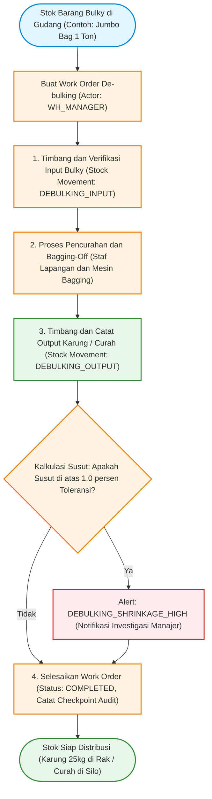
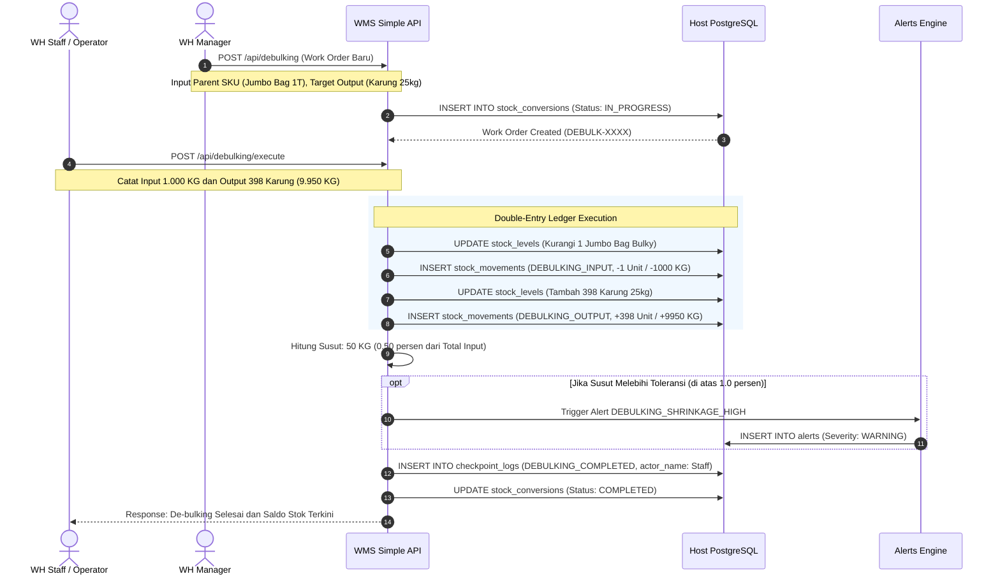

# 02_Bulky_Curah_and_Debulking.md

**Document:** Bulky, Curah (Bulk Cargo), and De-bulking Operations  
**Scope:** Inbound, Weighbridge, Storage, Conversion / Bagging-Off, Shrinkage Management  
**Version:** 2.0.0  
**Status:** LOCKED & ACTIVE  

---

## 1. Konsep Penanganan Kargo: Bulky vs Curah

Dalam sistem logistik komprehensif, komoditas dibagi menjadi beberapa kelompok penanganan fisik:

| Kategori Kargo | Karakteristik Fisik | Contoh Komoditas | Unit Penyimpanan / Kemasan | Kebutuhan Penanganan Khusus |
|---|---|---|---|---|
| **Bulky & Heavy Lift** | Barang ukuran besar, satuan terikat/unitized, berat > 500 kg per unit | Gula Rafinasi Jumbo Bag 1 Ton, Steel Coil, Bal Kapas, Mesin Pabrik | Jumbo Bag (FIBC), Steel Drum, Pallet Kayu Heavy, Kontainer | Forklift tonase besar (> 5 Ton), Crane, Floor Staging Area |
| **Curah Kering (Dry Bulk)** | Komoditas berbentuk butiran/tepung/bubuk tanpa kemasan individu | Gula pasir curah, Jagung, Gandum, Pupuk curah, Semen curah | Silo Kering, Bunker Gudang, Truk Dump Truck Curah | Jembatan Timbang Truk, Conveyor, Silo Discharge, Uji Kadar Air |
| **Curah Cair (Liquid Bulk)** | Cairan tanpa kemasan botol/jerigen | CPO (Minyak Sawit Mentah), Bahan Kimia Cair, BBM, Oli Curah | Tangki Timbun (*Storage Tank*), Truk Tangki (*Tanker*) | Jembatan Timbang / Flowmeter, Pompa Transfer, Segel Pipa |

---

## 2. Proses "Bulky yang Kemudian Dicurah" (De-bulking / Bagging-Off / Decanting)

**Definisi:** Proses operasional di gudang di mana barang masuk dalam bentuk kemasan besar (*Bulky Parent*), kemudian dipecah, dicurah, atau dikemas ulang (*repacking / bagging-off / decanting*) menjadi satuan yang lebih kecil (*Child Product*) atau dipindahkan ke silo curah untuk kebutuhan distribusi retail / sub-distributor.

### 2.1 Contoh Skenario Riil
1. **Gula Rafinasi / Pupuk:**
   - Masuk: 10 Unit Jumbo Bag @ 1.000 KG (Total 10.000 KG kargo bulky).
   - Proses De-bulking: Jumbo bag diangkat dengan forklift, bagian corong bawah dibuka di atas hopper mesin bagging.
   - Hasil Output: 398 Karung @ 25 KG (Total 9.950 KG).
   - Susut / Shrinkage: 50 KG (0.50% loss karena debu/penimbangan), masih dalam batas toleransi wajar (<= 1.0%).
2. **Oli Curah / Cairan Kimia:**
   - Masuk: 1 Truk Tangki ISO Tank 20.000 Liter (Bulky Liquid).
   - Proses Decanting: Cairan dialirkan ke dalam 100 Drum @ 200 Liter.

### 2.2 Rumus Perhitungan Susut (Shrinkage Rate)
$$\text{Susut (KG)} = \text{Total Berat Input Bulky (KG)} - \text{Total Berat Output Curah/Karung (KG)}$$
$$\text{Persentase Susut (\%)} = \left( \frac{\text{Susut (KG)}}{\text{Total Berat Input Bulky (KG)}} \right) \times 100\%$$

*Jika Persentase Susut > `allowable_shrinkage_percentage` (default 1.0%), sistem secara otomatis memicu `Alert: DEBULKING_SHRINKAGE_HIGH` untuk investigasi kepala gudang.*

---

## 3. Diagram Alur De-bulking (Flowchart)

---

## 4. Diagram Sequence De-bulking (Sequence Diagram)

