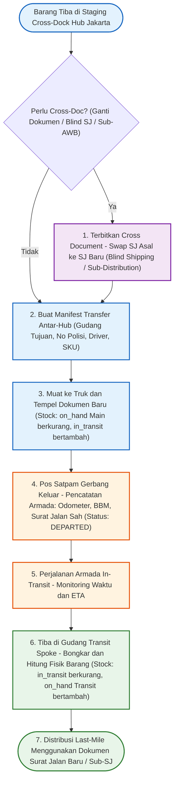
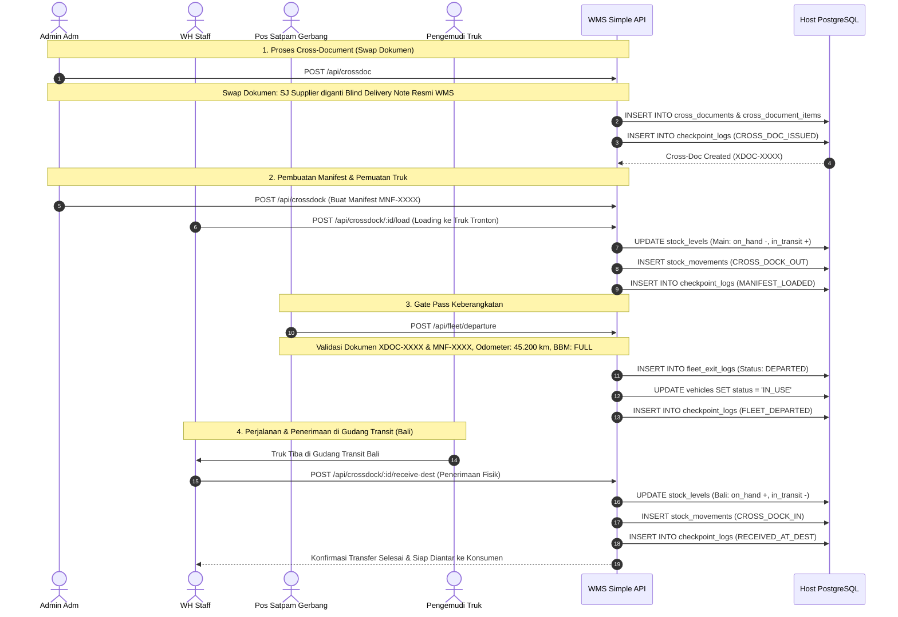

# 03_CrossDock_and_CrossDocument.md

**Document:** Cross-Docking & Cross-Document Operations  
**Definitions:** Line-Haul Inter-Hub Transfer, Document Swap, Re-issuance, Sub-AWB & Sub-SJ Generation  
**Version:** 2.0.0  
**Status:** LOCKED & ACTIVE  

---

## 1. Definisi & Standar Industri Cross Document

Dalam industri logistik, pergudangan, dan 3PL (*Third-Party Logistics*), **Cross Document (Cross-Doc)** adalah:

> **Proses mengubah, mengganti, atau menerbitkan ulang dokumen pengiriman**—seperti Surat Jalan (SJ), Delivery Note (DN), atau Airway Bill (AWB)—untuk menyesuaikan informasi logistik, alamat tujuan, rute pengiriman, atau menjaga kerahasiaan komersial sebelum barang dikirimkan ke penerima akhir (*consignee*).

### 1.1 Skenario Penggunaan Cross Document
1. **Blind Shipping (Kerahasiaan Vendor Asal):**
   - Supplier mengirim barang ke Gudang Hub dengan Surat Jalan Supplier mencantumkan harga dan nama pabrik.
   - Gudang menerbitkan Surat Jalan Pengiriman Baru (*Blind Delivery Note*) yang ditujukan ke pelanggan akhir tanpa mencantumkan identitas pabrik asal.
2. **De-konsolidasi Sub-Surat Jalan (Hub-and-Spoke Spoke Route):**
   - 1 Master PO/Manifest dari Jakarta membawa 500 koli barang untuk area Bali.
   - Di Gudang Transit Denpasar, dokumen dipecah menjadi 10 Sub-Surat Jalan (*House SJ / Delivery Note*) untuk masing-masing toko retail di Denpasar, Tabanan, Singaraja.
3. **Penyatuan / Konsolidasi Dokumen:**
   - Menggabungkan barang dari 3 supplier berbeda menjadi 1 Surat Jalan Pengiriman Konsolidasi untuk 1 customer besar.

---

## 2. Diagram Alur Cross-Docking & Cross-Document (Flowchart)

---

## 3. Diagram Sequence Cross-Document & Cross-Dock (Sequence Diagram)

