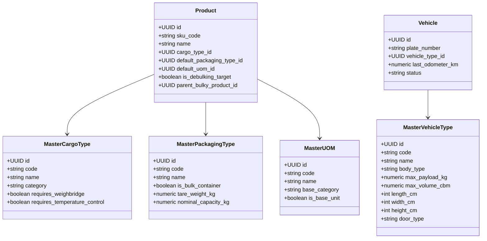

# 04_Dynamic_Master_Data_and_Fleet.md

**Document:** Dynamic Master Data Architecture & Fleet Classification  
**Target:** Elimination of Hardcoded Enums, Full CRUD Management, Vehicle Spec Accommodation  
**Version:** 2.0.0  
**Status:** LOCKED & ACTIVE  

---

## 1. Prinsip Master Data Dinamis (No Hardcoded Enums)

Seluruh entitas master data pada WMS Simple **dikelola secara dinamis melalui database dan REST API**, bukan berupa tipe ENUM kaku di source code. Hal ini memungkinkan pengguna menambahkan jenis armada baru, tipe kargo baru, atau satuan ukur baru tanpa perlu mengubah baris kode atau melakukan *database schema migration*.

---

## 2. Akomodasi Ragam Jenis Armada Logistik di Indonesia

Sistem WMS Simple mengakomodir klasifikasi teknis armada darat secara komprehensif:

| Kode Tipe Armada | Nama Armada | Tipe Bodi | Roda / As | Daya Angkut (Max Payload) | Volume Max (CBM) | Dimensi Bak / Box (P x L x T cm) | Tipe Pintu / Bongkar | Kompatibilitas Kargo |
|---|---|---|:---:|:---:|:---:|:---:|---|---|
| **`CDE_BOX`** | Colt Diesel Engkel | Box Tertutup | 4 Roda / 2 As | **2.500 KG (2.5 T)** | 10 CBM | 310 x 170 x 170 | Pintu Belakang (Rear) | General Cargo, Retail FMCG |
| **`CDD_BOX`** | Colt Diesel Double | Box Tertutup | 6 Roda / 2 As | **5.000 KG (5.0 T)** | 18 CBM | 430 x 200 x 200 | Pintu Belakang | Packaged Goods, Elektronik |
| **`CDD_LONG`** | CDD Long Chassis | Box Panjang | 6 Roda / 2 As | **6.000 KG (6.0 T)** | 24 CBM | 560 x 200 x 210 | Pintu Belakang | Kargo Ringan Volume Besar |
| **`FUSO_BAK`** | Fuso Bak Terbuka | Bak Drop Side | 6 Roda / 2 As | **10.000 KG (10 T)** | 30 CBM | 650 x 240 x 180 | Buka Samping & Belakang | Besi, Pipa, Semen Sak, Pallet |
| **`TRONTON_WINGBOX`** | Tronton Wingbox | Wingbox Aluminium | 10 Roda / 3 As | **18.000 KG (18 T)** | 48 CBM | 940 x 245 x 240 | Sayap Kanan-Kiri & Belakang | Fast Cross-Docking, Palletized |
| **`DUMP_TRUCK_CURAH`**| Dump Truck Curah | Bak Besi Hidrolik | 10 Roda / 3 As | **22.000 KG (22 T)** | 24 CBM | 700 x 240 x 150 | Tumpah Belakang (Dump) | Curah Kering (Pasir, Jagung) |
| **`TANKER_CPO_30KL`** | Truk Tangki Cairan | Tangki Stainless/Besi| 10 Roda / 3 As | **26.000 KG (26 T)** | 30 KL | 850 x 240 x 200 | Corong Atas (Top Hatch) & Valve | Curah Cair (CPO, BBM, Oli) |
| **`TRAILER_40FT`** | Tractor Head Flatbed | Flatbed Trailer | Multi As | **32.000 KG (32 T)** | 65 CBM | 1220 x 245 x 250 | Rata / Crane Loading | Kontainer 40ft, Heavy Bulky |

---

## 3. Validasi Otomatis Keputusan Muatan (Decision Support Engine)

Saat pembuatan **Cross-Dock Manifest** atau **Outbound Shipping**, sistem secara otomatis:
1. Menjumlahkan total berat kargo: $\sum (\text{Qty} \times \text{Berat per Unit})$
2. Menjumlahkan total volume kargo: $\sum (\text{Qty} \times \text{Volume per Unit})$
3. Memeriksa apakah `Total Berat <= vehicle_type.max_payload_kg`
4. Memeriksa apakah `Total Volume <= vehicle_type.max_volume_cbm`
5. Memvalidasi kesesuaian jenis bodi kendaraan terhadap kargo (misal: barang curah kering harus menggunakan armada bertipe `DUMP_TRUCK` atau `BAK_TERBUKA` berterpal).
