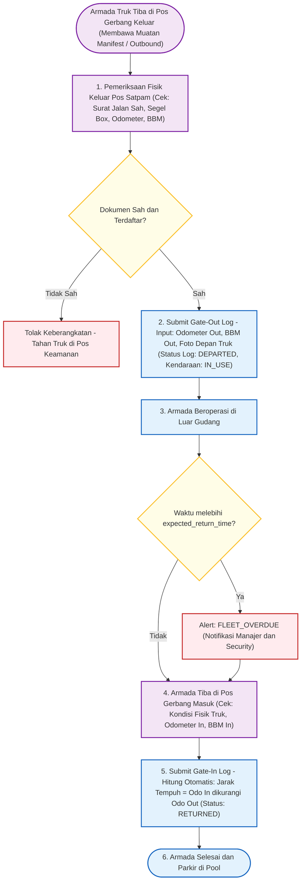
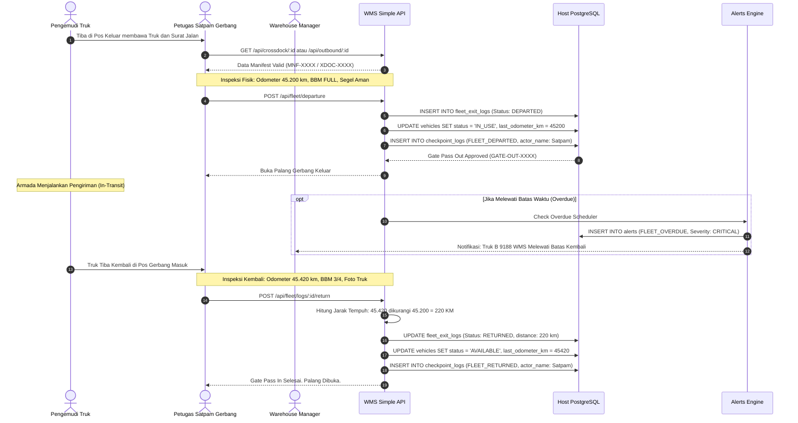

# 05_Fleet_Exit_and_Security_Gate_Flows.md

**Document:** Fleet Exit Log & Security Gate Pass Specification  
**Operations Area:** Security Post, Gate-Out Inspection, Gate-In Check, Overdue Monitoring  
**Version:** 2.0.0  
**Status:** LOCKED & ACTIVE  

---

## 1. Diagram Alur Pos Satpam Gerbang (Flowchart)

---

## 2. Diagram Sequence Pos Satpam Gerbang (Sequence Diagram)

