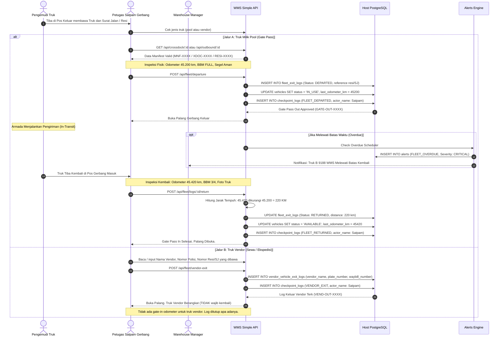

# 05_Fleet_Exit_and_Security_Gate_Flows.md

**Document:** Fleet Exit Log & Security Gate Pass Specification  
**Operations Area:** Security Post, Gate-Out Inspection (Pool & Vendor), Gate-In Check, Overdue Monitoring  
**Version:** 3.0.0  
**Status:** LOCKED & ACTIVE  

---

## 1. Prinsip Dasar (v3.0.0)

1. **Dua alur terpisah di pos satpam keluar:**
   - **Jalur A — Armada Pool (Gate Pass):** truk milik perusahaan. Mewajibkan pemeriksaan fisik lengkap: odometer keluar, level BBM, foto truk, dan dokumen resi/surat jalan yang sah. Status armada berubah `AVAILABLE → IN_USE` dan hanya kembali `AVAILABLE` setelah gate-in.
   - **Jalur B — Truk Vendor (Log Keluar Vendor):** truk sewa/ekspedisi eksternal. Wajib dicatat: **nama vendor**, **nomor polisi (manual)**, dan **nomor resi/surat jalan yang dibawa**. Tidak menyentuh master armada pool dan tidak mengubah status kendaraan apa pun.
2. **Truk vendor tidak wajib kembali.** Log keluar vendor ditutup apa adanya (bisa ditandai selesai tanpa peristiwa kembali). Hanya jalur pool yang punya siklus keluar-masuk dengan odometer.
3. **Tidak ada truk keluar tanpa dokumen.** Satpam wajib memvalidasi nomor resi/SJ pada kedua jalur; keberangkatan tanpa resi valid ditolak.
4. **Kembali ke pool bukan akhir transaksi barang.** Akhir transaksi tetap satu: POD terverifikasi untuk penagihan (lihat `06_Outbound_and_POD_Flows.md`).

---

## 2. Diagram Alur Pos Satpam Gerbang (Flowchart)

```mermaid
flowchart TD
    classDef gate fill:#f3e5f5,stroke:#7b1fa2,stroke-width:2px;
    classDef action fill:#e3f2fd,stroke:#1565c0,stroke-width:2px;
    classDef decide fill:#fffde7,stroke:#fbc02d,stroke-width:2px;
    classDef alert fill:#ffebee,stroke:#c62828,stroke-width:2px;
    classDef vendor fill:#e1f5fe,stroke:#0288d1,stroke-width:2px;

    ARRIVE_GATE(["Armada Truk Tiba di Pos Gerbang Keluar (Membawa Muatan + Resi/SJ Sah)"]):::gate --> FORK{"Truk Milik Siapa?"}:::decide

    FORK -->|"Milik Pool Sendiri"| POOL_PATH
    FORK -->|"Vendor (Sewa / Ekspedisi)"| VENDOR_PATH

    subgraph POOL_PATH["Jalur A — Armada Pool (Gate Pass)"]
        INSP_OUT["1. Pemeriksaan Fisik Keluar: Surat Jalan Sah, Segel Box, Odometer, BBM, Foto Truk"]:::gate
        INSP_OUT --> VALID_DOC{"Dokumen Sah dan Terdaftar?"}:::decide
        VALID_DOC -->|Tidak Sah| REJECT_GATE["Tolak Keberangkatan - Tahan Truk di Pos Keamanan"]:::alert
        VALID_DOC -->|Sah| SUBMIT_GATE_OUT["2. Submit Gate-Out Log: Odometer Out, BBM Out, Foto (Status: DEPARTED, Kendaraan: IN_USE)"]:::action
        SUBMIT_GATE_OUT --> TRIP["3. Armada Beroperasi di Luar Gudang"]:::action
        TRIP --> TIME_CHECK{"Waktu melebihi expected_return_time?"}:::decide
        TIME_CHECK -->|Ya| ALERT_OVERDUE["Alert: FLEET_OVERDUE (Notifikasi Manajer dan Security)"]:::alert
        TIME_CHECK -->|Tidak| GATE_IN
        ALERT_OVERDUE --> GATE_IN
        GATE_IN["4. Armada Tiba di Pos Gerbang Masuk: Kondisi Fisik, Odometer In, BBM In"]:::gate
        GATE_IN --> SUBMIT_GATE_IN["5. Submit Gate-In Log: Jarak Tempuh Otomatis = Odo In dikurangi Odo Out (Status: RETURNED)"]:::action
        SUBMIT_GATE_IN --> COMPLETED(["6. Armada Selesai dan Parkir di Pool"]):::action
    end

    subgraph VENDOR_PATH["Jalur B — Truk Vendor (Log Keluar Vendor)"]
        V_INSP["V1. Pemeriksaan Keluar: Catat Nama Vendor, Nomor Polisi (manual), Nomor Resi/SJ yang Dibawa"]:::vendor
        V_INSP --> V_DOC{"Resi/SJ Valid?"}:::decide
        V_DOC -->|Tidak Valid| V_REJECT["Tolak Keberangkatan - Minta Dokumen yang Sah"]:::alert
        V_DOC -->|Valid| V_SUBMIT["V2. Submit Vendor Exit Log: Vendor, Nopol, No. Resi, Tujuan, Foto (Opsional)"]:::vendor
        V_SUBMIT --> V_CLOSE(["V3. Log Keluar Vendor Terk Tutup - Truk Vendor TIDAK Wajib Kembali"]):::vendor
    end
```

---

## 3. Diagram Sequence Pos Satpam Gerbang (Sequence Diagram)

---

## 4. Dampak ke Aplikasi (Rencana Implementasi Backend)

1. **Tabel baru `vendor_vehicle_exit_logs`** (Jalur B): `id, log_number (VEND-OUT-XXXX), warehouse_id, vendor_name, plate_number, vehicle_type (opsional), driver_name, waybill_number (wajib), reference_type, reference_id, destination_note, departure_security_officer, departure_photo_url, notes, closed_at, created_at`. Tidak ada kolom odometer/BBM — itu khusus armada pool.
2. **Endpoint baru:** `POST /api/fleet/vendor-exit` (nama vendor + nopol + resi wajib), `GET /api/fleet/vendor-exits` (daftar + filter), opsional `POST /api/fleet/vendor-exits/:id/close`.
3. **`fleet_exit_logs` (Jalur A) diperkaya:** kolom `waybill_number` (resi/SJ yang dibawa) wajib terisi saat departure.
4. **Checkpoint audit:** kedua jalur tetap masuk `checkpoint_logs` dengan `step_code` berbeda (`FLEET_DEPARTED` / `VENDOR_EXIT`) dan nama petugas satpam wajib.
