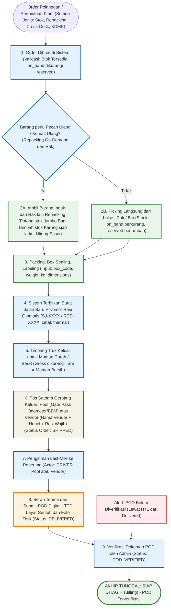
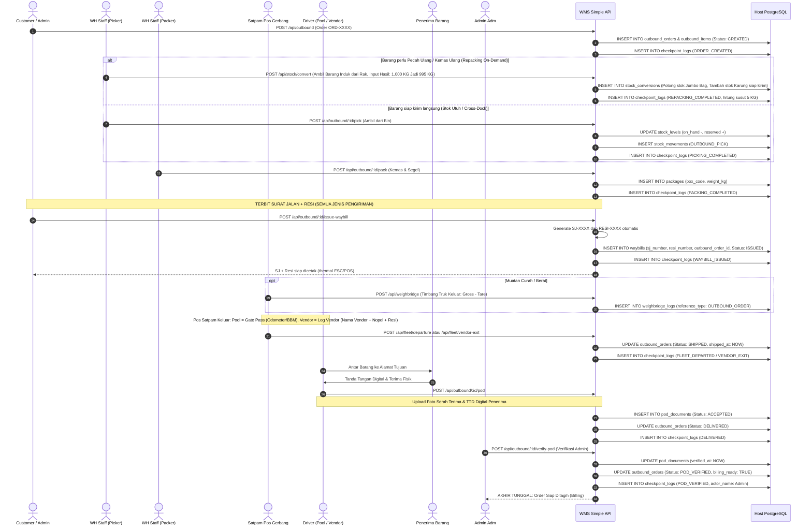

# 06_Outbound_and_POD_Flows.md

**Document:** Outbound Fulfillment & Digital POD Flow Specification  
**Operations Area:** Order Processing, Waybill & Resi Issuance, Bin Picking, Packing/Boxing, Shipping, Delivery POD, Billing Handoff  
**Version:** 3.1.0  
**Status:** LOCKED & ACTIVE  

---

## 1. Prinsip Dasar (v3.1.0)

1. **Satu titik penerbitan dokumen untuk SEMUA pengiriman keluar.** Baik barang dari stok gudang, hasil repacking (de-bulking), cross-dock antar-hub, maupun KDMP — sistem **otomatis menerbitkan Surat Jalan Baru + Nomor Resi** saat barang mau keluar. Cross-Doc Swap (blind shipping) menjadi salah satu varian penerbitan, bukan satu-satunya jalur.
2. **Nomor resi auto-generate sistem** dengan format `RESI-XXXXXXXX` dan SJ `SJ-XXXXXXXX`, tertaut ke order dan tercatat di checkpoint audit. Pencetakan struk thermal tersedia via modul ESC/POS.
3. **Timbang truk keluar** untuk muatan curah/berat: gross − tare = berat muatan bersih, tercatat sebagai tiket jembatan timbang saat barang keluar. Tidak ada timbang truk masuk di alur ini.
4. **Akhir transaksi tunggal: POD terverifikasi admin → SIAP DITAGIH.** Kembalinya truk ke pool adalah catatan armada (lihat `05_Fleet_Exit_and_Security_Gate_Flows.md`), bukan penutup transaksi barang.
5. **Truk pengangkut bisa pool atau vendor.** Untuk vendor: nama vendor + nopol + resi wajib tercatat di pos satpam (Jalur B, doc 05).

---

## 2. Diagram Alur Outbound (Flowchart)

---

## 3. Diagram Sequence Outbound & POD (Sequence Diagram)

---

## 4. Dampak ke Aplikasi (Rencana Implementasi Backend)

1. **Tabel baru `waybills`:** `id, sj_number (SJ-XXXXXXXX, unique), resi_number (RESI-XXXXXXXX, unique), reference_type (OUTBOUND_ORDER | CROSS_DOCK_MANIFEST), reference_id, issued_by_id, issued_by_name, issued_at, status (ISSUED | PRINTED | IN_TRANSIT | POD_VERIFIED | VOID), notes, created_at`. Cross-doc `cross_documents.target_document_number` tetap dipertahankan sebagai varian blind shipping; waybill generik menjadi penerbitan utama semua jalur.
2. **Endpoint baru:** `POST /api/outbound/:id/issue-waybill` (auto-generate SJ + resi; dipanggil setelah pack atau langsung pada jalur cross-dock/KDMP), `GET /api/waybills?status=`, opsional `POST /api/waybills/:id/void`.
3. **Kolom `billing_ready`** pada `outbound_orders` (true saat `POD_VERIFIED`) sebagai penanda tunggal untuk modul penagihan.
4. **Frontend:** tombol "Terbitkan SJ + Resi" di halaman outbound (setelah packing) dengan struk thermal; halaman POD menampilkan nomor resi; daftar waybill dengan filter status.
5. **Checkpoint audit:** `WAYBILL_ISSUED` masuk rantai checkpoint dengan nama petugas penerbit wajib (kepatuhan `Mandatory Petugas Name`).
