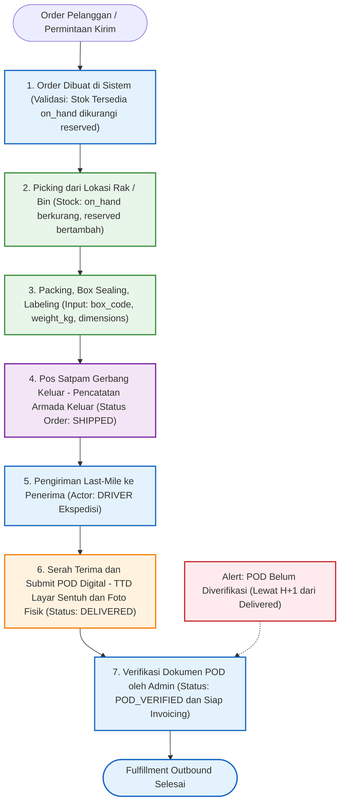
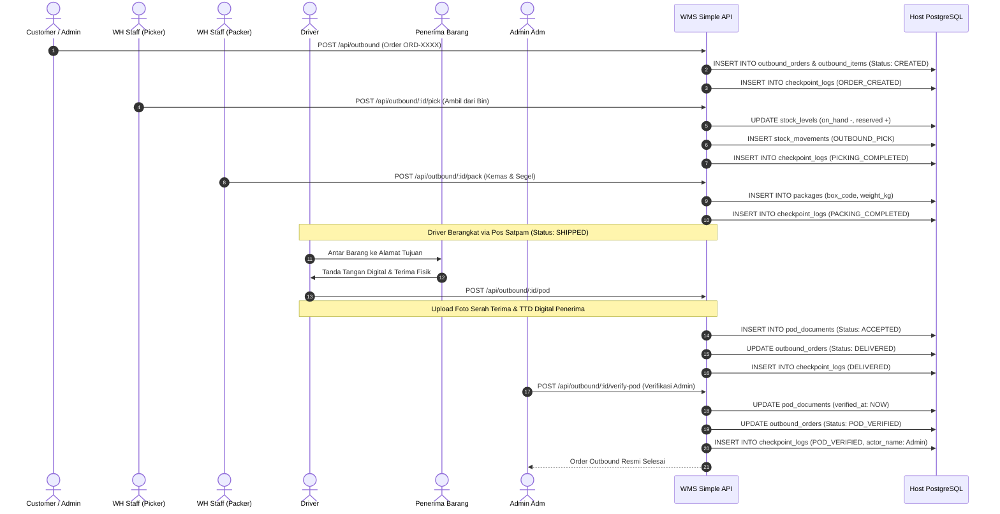

# 06_Outbound_and_POD_Flows.md

**Document:** Outbound Fulfillment & Digital POD Flow Specification  
**Operations Area:** Order Processing, Bin Picking, Packing/Boxing, Shipping, Delivery POD  
**Version:** 2.0.0  
**Status:** LOCKED & ACTIVE  

---

## 1. Diagram Alur Outbound (Flowchart)

---

## 2. Diagram Sequence Outbound & POD (Sequence Diagram)

