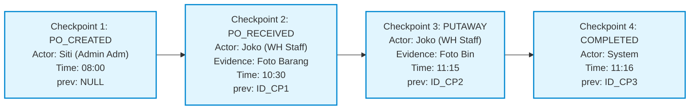

# 06_Stock_and_Checkpoint_Chain.md

**Document:** Inventory Ledger & Checkpoint Chain Architecture  
**Core Features:** Multi-Warehouse Stock Snapshot, Double-Entry Movement Ledger, Immutable Audit Trail, SLA Alerting  
**Version:** 1.0.0  
**Status:** LOCKED & ACTIVE  

---

## 1. Arsitektur Buku Besar Stok (Double-Entry Stock Ledger)

WMS Simple tidak pernah melakukan pembaruan kuantitas stok secara langsung (*blind update*) tanpa mencatatkan baris transaksi ke tabel `stock_movements`. Hal ini memastikan akurasi saldo stok 100% dapat diaudit kembali (*reconcilable*) dari titik awal (*genesis opname*).

### 1.1 Snapshot Saldo Stok (`stock_levels`)
Setiap gudang dan SKU memiliki satu baris saldo aktif yang membagi stok ke dalam 3 status:
- **`qty_on_hand` (Stok Fisik Tersedia):** Kuantitas aktual yang berada di dalam gudang dan bebas untuk dialokasikan ke pesanan baru.
- **`qty_reserved` (Stok Terpesan):** Kuantitas barang yang sedang dalam proses picking/packing untuk pesanan outbound yang telah disetujui.
- **`qty_in_transit` (Stok Dalam Perjalanan):** Kuantitas barang yang telah dimuat ke truk dan sedang menuju ke gudang transit spoke.

### 1.2 8 Tipe Mutasi Stok Standar Industri (`stock_movements`)

| Kode Mutasi | Arah Aliran | Pemicu Transaksi (Trigger) | Dampak Saldo Gudang Asal | Dampak Saldo Gudang Tujuan |
|---|---|---|:---:|:---:|
| **`INBOUND_RECEIVE`** | Vendor → Gudang Penerima | PO Diterima Fisik di Area Staging | - | `qty_on_hand (+)` |
| **`INBOUND_PUTAWAY`** | Staging → Rak Bin Penyimpanan | Putaway ke Bin Selesai | `locations.current_qty (+)` | `locations.current_qty (+)` |
| **`CROSS_DOCK_OUT`** | Gudang Utama → In-Transit Truk | Barang Dimuat ke Truk Manifest | `qty_on_hand (-)` | `qty_in_transit (+)` |
| **`CROSS_DOCK_IN`** | In-Transit Truk → Gudang Transit | Truk Tiba & Dibongkar di Cabang | `qty_in_transit (-)` | `qty_on_hand (+) (Transit WH)` |
| **`OUTBOUND_PICK`** | Rak Penyimpanan → Meja Packing | Staf Mengambil Barang dari Rak | `qty_on_hand (-)`, `qty_reserved (+)` | `locations.current_qty (-)` |
| **`OUTBOUND_SHIP`** | Meja Packing → Ekspedisi / Pelanggan | Truk Pengiriman Berangkat | `qty_reserved (-)` | - |
| **`ADJUSTMENT`** | Penyesuaian Fisik (Opname / Rusak) | Berita Acara Stock Opname Disetujui | `qty_on_hand (+/-)` | - |
| **`TRANSFER`** | Mutasi Internal Antar Bin | Relokasi Antar Rak di Gudang yang Sama | `Bin A (-)` | `Bin B (+)` |

---

## 2. Arsitektur Rantai Audit Checkpoint (Checkpoint Chain)

Untuk mencegah manipulasi data masa lalu dan menjamin kepatuhan terhadap SOP, setiap transaksi entitas utama (`INBOUND_ORDER`, `CROSS_DOCK_MANIFEST`, `OUTBOUND_ORDER`, `FLEET_EXIT_LOG`) membentuk **rantai log tak terputus (*linked list chain*)**.

### 2.1 Komponen Wajib Rekaman Checkpoint (`checkpoint_logs`)
1. **`entity_type` & `entity_id`:** Entitas bisnis yang diproses.
2. **`step_code` & `step_label`:** Kode langkah baku (misal: `PO_RECEIVED`, `MANIFEST_LOADED`, `FLEET_DEPARTED`, `POD_VERIFIED`).
3. **`actor_name` (*Nama Petugas Wajib*):** Nama personel operasional yang menjalankan langkah tersebut secara fisik.
4. **`actor_role`:** Peran pengguna dalam sistem saat melakukan tindakan.
5. **`photo_urls` (Array JSONB):** Daftar URL foto barang, kondisi kemasan, atau surat jalan sebagai bukti fisik.
6. **`prev_checkpoint_id`:** Pointer foreign key ke ID checkpoint sebelumnya dalam alur transaksi yang sama.

---

## 3. Sistem Peringatan Real-Time (Alerts Engine)

Sistem memantau kondisi operasional secara berkala dan memicu *Alert* otomatis saat terjadi anomali atau pelanggaran SLA:

| Tipe Alert | Pemicu (Trigger Condition) | Tingkat Keparahan (Severity) | Penerima Notifikasi |
|---|---|:---:|---|
| **`CHECKPOINT_TIMEOUT`** | Status tidak berubah melewati batas waktu (Contoh: PO lewat 24 jam dari ETA belum diterima) | `WARNING` | ADMIN_ADM, WH_MANAGER |
| **`STOCK_MIN_BREACH`** | Saldo `qty_on_hand < products.min_stock_qty` | `WARNING` | ADMIN_ADM, WH_MANAGER |
| **`VARIANCE_DETECTED`** | Terdapat selisih kuantitas antara muat manifest dan terima fisik di cabang transit | `CRITICAL` | ADMIN_ADM, WH_MANAGER (Kedua Hub) |
| **`TRANSIT_DELAY`** | Armada in-transit belum tiba melewati estimasi waktu tiba (ETA) + toleransi 3 jam | `WARNING` | ADMIN_ADM, Pengemudi |
| **`FLEET_OVERDUE`** | Armada melewati `expected_return_time` dan belum tercatat kembali di pos satpam | `CRITICAL` | WH_MANAGER, Pos Satpam Gerbang |
| **`POD_REJECTED`** | Pelanggan menolak penerimaan barang saat serah terima di lokasi tujuan | `CRITICAL` | ADMIN_ADM, WH_MANAGER |
