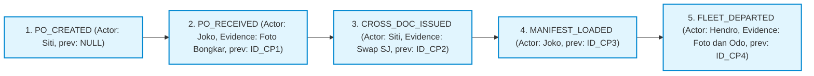
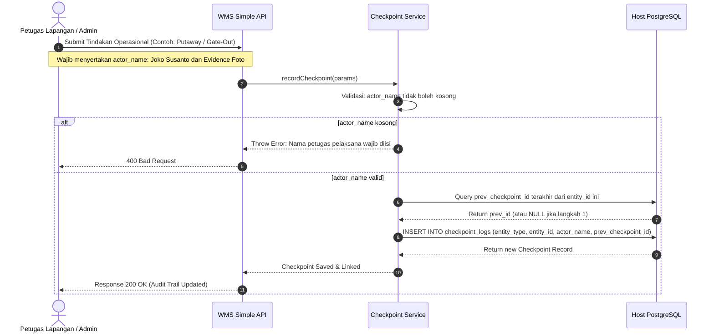

# 07_Checkpoint_Chain_and_Audit.md

**Document:** Immutable Checkpoint Chain & Audit Trail Architecture  
**Core Principles:** Cryptographic/Linked-List Integrity, Mandatory Petugas Name, Zero Ambiguity  
**Version:** 2.0.0  
**Status:** LOCKED & ACTIVE  

---

## 1. Arsitektur Rantai Audit Checkpoint (Linked-List Chain)

Setiap aksi perpindahan status atau pemutakhiran fisik dalam WMS Simple secara otomatis dicatat dalam rantai log yang menunjuk ke ID checkpoint sebelumnya (`prev_checkpoint_id`). Hal ini menjamin bahwa seluruh riwayat transaksi tidak dapat disisipkan atau dimanipulasi di tengah jalan.

### 1.1 Struktur Data Rekaman Checkpoint (`checkpoint_logs`)
- `id`: UUID Primary Key.
- `entity_type`: Tipe entitas bisnis (`INBOUND_ORDER`, `STOCK_CONVERSION`, `CROSS_DOCK_MANIFEST`, `CROSS_DOCUMENT`, `OUTBOUND_ORDER`, `FLEET_EXIT_LOG`).
- `entity_id`: UUID referensi dokumen induk.
- `entity_number`: Nomor identitas dokumen resmi yang mudah dibaca manusia (misal: `PO-12345678`, `XDOC-88991122`, `GATE-OUT-55443322`).
- `step_code` & `step_label`: Kode langkah terstandarisasi.
- `actor_name` (*Mandatory Petugas Name*): Nama personel pelaksana fisik (validasi wajib minimal 2 karakter).
- `actor_role`: Peran pengguna saat aksi dilakukan.
- `photo_urls` (JSONB): Array URL bukti fisik.
- `metadata` (JSONB): Parameter numerik atau catatan teknis tambahan.
- `prev_checkpoint_id`: Pointer ke baris log audit sebelumnya.

---

## 2. Diagram Sequence Pembuatan Checkpoint (Sequence Diagram)

