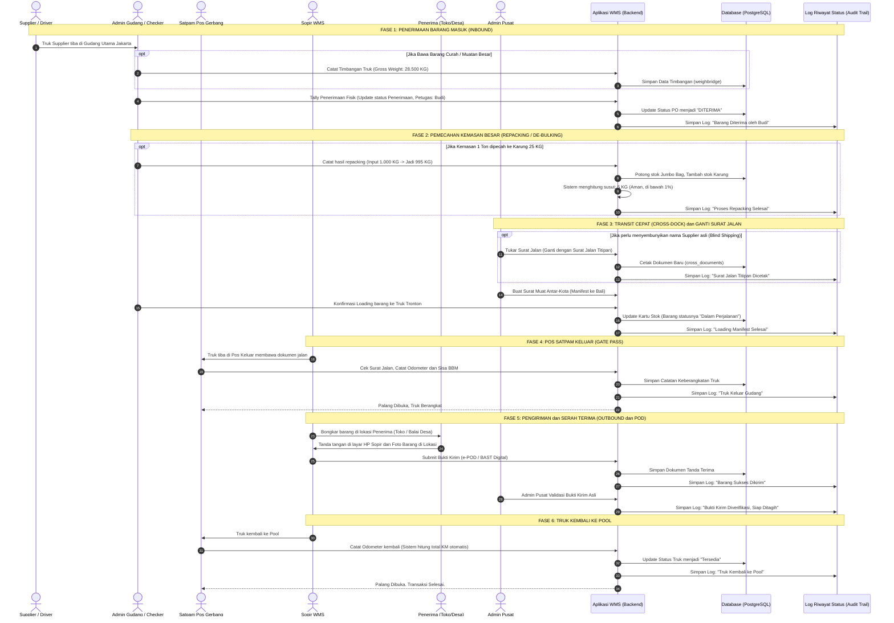

# 09_Master_End_to_End_Flow_and_Sequence.md

**Document:** Master Diagram Alur & Urutan Kerja (End-to-End Operational Flow)  
**System:** WMS Simple Enterprise  
**Version:** 2.4.0 (Simplified Logistics Jargon)  
**Status:** ACTIVE  

---

## 1. Diagram Alur Operasional Gudang (Master Flowchart)

Diagram ini menggambarkan seluruh proses fisik barang dari saat truk tiba di gudang utama hingga barang diserahterimakan ke tujuan akhir (toko/balai desa). Bahasa yang digunakan disesuaikan dengan istilah operasional logistik sehari-hari.

```mermaid
flowchart TD
    classDef vendor fill:#e1f5fe,stroke:#0288d1,stroke-width:1.5px;
    classDef mainHub fill:#f3e5f5,stroke:#7b1fa2,stroke-width:1.5px;
    classDef debulk fill:#fff3e0,stroke:#f57c00,stroke-width:1.5px;
    classDef xdoc fill:#fce4ec,stroke:#c2185b,stroke-width:1.5px;
    classDef gate fill:#efebe9,stroke:#5d4037,stroke-width:1.5px;
    classDef transit fill:#e8f5e9,stroke:#388e3c,stroke-width:1.5px;
    classDef outbound fill:#e0f2f1,stroke:#00796b,stroke-width:1.5px;
    classDef alert fill:#ffebee,stroke:#c62828,stroke-width:1.5px;

    VENDOR(["1. Truk Supplier Tiba (Bawa Barang Packaged, Karungan, Curah, atau Showcase)"]):::vendor --> WB_CHECK{"Bawa Barang Curah / Berat?"}
    
    WB_CHECK -->|Ya| WB_IN["Timbang Truk (Weighbridge)"]:::mainHub
    WB_CHECK -->|Tidak| DOCK_RCV["Penerimaan di Dock (Tally Fisik, Scan Barcode, Foto Barang)"]:::mainHub
    WB_IN --> DOCK_RCV

    DOCK_RCV --> SORT_DECISION{"2. Mau Dikemanakan Barangnya?"}

    SORT_DECISION -->|Perlu Dipecah / Dikemas Ulang| DEBULK_WO["3A. Proses Repacking / Pencurahan (Dari Jumbo Bag ke Karung)"]:::debulk
    DEBULK_WO --> DEBULK_CALC["Timbang Hasil Repacking dan Hitung Susut (Shrinkage)"]:::debulk
    DEBULK_CALC --> LOSS_CHECK{"Susut > 1.0%?"}:::debulk
    LOSS_CHECK -->|Ya| ALERT_LOSS["Peringatan: Susut Barang Terlalu Tinggi!"]:::alert
    LOSS_CHECK -->|Tidak| PUTAWAY_STORAGE
    ALERT_LOSS --> PUTAWAY_STORAGE

    SORT_DECISION -->|Simpan ke Rak| PUTAWAY_STORAGE["3B. Simpan Barang (Putaway) ke Lokasi Rak / Area Simpan"]:::mainHub

    SORT_DECISION -->|Transit Cepat (Cross-Dock)| XDOC_CHECK{"Perlu Tukar Surat Jalan?"}
    XDOC_CHECK -->|Ya| XDOC_SWAP["3C. Cetak Surat Jalan Baru / Surat Jalan Titipan (Blind DO)"]:::xdoc
    XDOC_CHECK -->|Tidak| CD_MANIFEST
    XDOC_SWAP --> CD_MANIFEST["4. Buat Surat Muat (Manifest) dan Loading ke Truk Antar-Kota"]:::mainHub

    CD_MANIFEST --> GATE_OUT["5. Pos Satpam Keluar (Cek Surat Jalan, KM Odometer, Sisa BBM)"]:::gate
    GATE_OUT --> TRANSIT_TRIP["6. Truk Berangkat Antar-Kota (In-Transit)"]:::gate
    TRANSIT_TRIP --> ARRIVE_TRANSIT["7. Tiba di Gudang Cabang (Bongkar Muat dan Cek Fisik)"]:::transit

    PUTAWAY_STORAGE --> OUT_ORDER["8. Terima Permintaan Kirim (Sales Order / DO)"]:::outbound
    ARRIVE_TRANSIT --> OUT_ORDER

    OUT_ORDER --> PICK_PACK["9. Ambil Barang dari Rak (Picking) dan Muat (Loading)"]:::outbound
    PICK_PACK --> GATE_OUT_DELIV["10. Pos Satpam Keluar (Gate Pass Pengiriman)"]:::gate
    GATE_OUT_DELIV --> SHIPPING["11. Truk Berangkat Kirim ke Toko / Balai Desa"]:::outbound

    SHIPPING --> POD_SUBMIT["12. Serah Terima Barang (Bukti Kirim Elektronik / e-POD / BAST)"]:::outbound
    POD_SUBMIT --> ADMIN_VERIFY["13. Admin Memeriksa Bukti Kirim (Siap Penagihan/Billing)"]:::mainHub
    SHIPPING --> GATE_IN["14. Truk Kembali ke Pool (Satpam Cek Odometer Akhir)"]:::gate
    GATE_IN --> MASTER_END(["15. Transaksi Selesai dan Kartu Stok Terkunci Mutlak"]):::mainHub
```

---

## 2. Urutan Interaksi Sistem (Sequence Diagram)

Diagram ini menunjukkan interaksi antara tim lapangan, sistem (Hono API), Database (PostgreSQL), dan sistem pelacakan riwayat (Audit Trail/Log Status).


