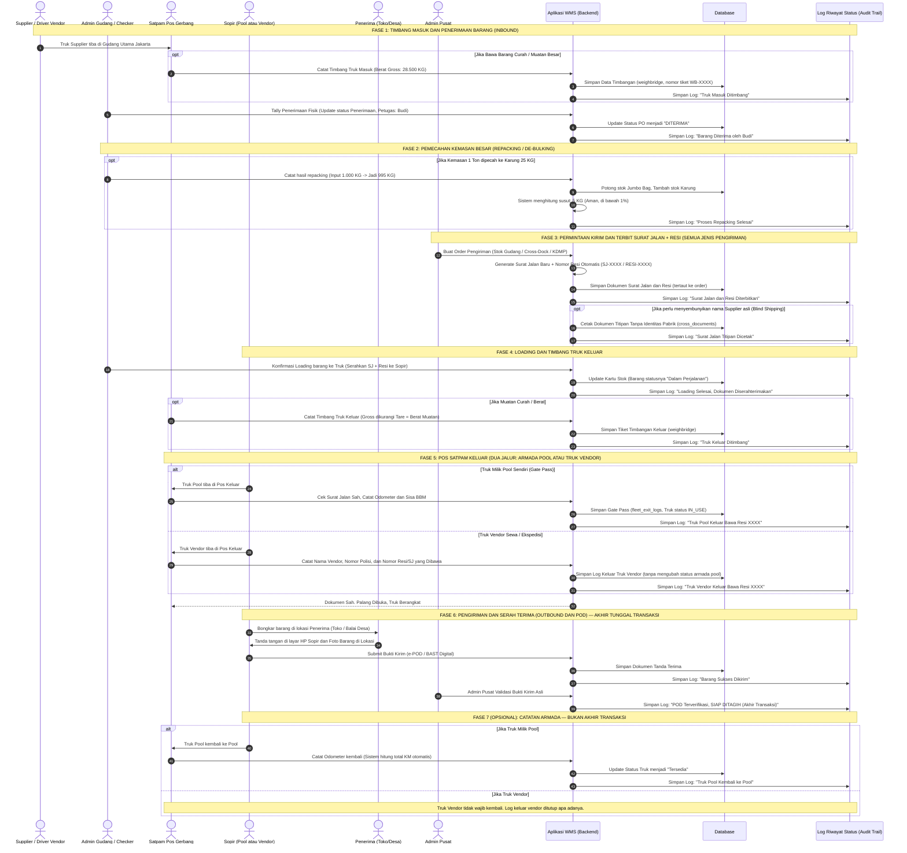

# 09_Master_End_to_End_Flow_and_Sequence.md

**Document:** Master Diagram Alur & Urutan Kerja (End-to-End Operational Flow)  
**System:** WMS Simple Enterprise  
**Version:** 3.0.0 (Universal Waybill & Dual Gate-Out)  
**Status:** ACTIVE  

---

## 1. Diagram Alur Operasional Gudang (Master Flowchart)

Diagram ini menggambarkan seluruh proses fisik barang dari saat truk tiba di gudang utama hingga bukti kirim terverifikasi dan siap ditagih. Prinsip alur ini:

1. **Timbang truk masuk dan keluar** — semua truk yang lewat jembatan timbang (khususnya muatan curah/berat) wajib dicatat berat gross-nya saat masuk dan saat keluar, sehingga berat muatan bersih terukur nyata (bukan perkiraan).
2. **Surat jalan baru + nomor resi diterbitkan untuk SEMUA pengiriman keluar** — bukan hanya cross-dock. Baik barang dari stok gudang, hasil repacking, cross-dock antar-hub, maupun KDMP, sistem otomatis membuat Surat Jalan baru dan Nomor Resi saat barang mau keluar.
3. **Pos satpam keluar mencatat identitas truk secara lengkap** — untuk truk vendor (sewa/ekspedisi) wajib dicatat: nama vendor, nomor polisi, dan nomor resi/surat jalan yang dibawa.
4. **Truk vendor tidak wajib kembali** — hanya armada milik pool yang dicatat kembali (gate-in odometer). Truk vendor cukup tercatat di log keluar.
5. **Akhir transaksi hanya satu: POD terverifikasi untuk penagihan (billing).** Pergerakan truk kembali ke pool adalah catatan logistik armada, bukan akhir transaksi barang.

```mermaid
flowchart TD
    classDef vendor fill:#e1f5fe,stroke:#0288d1,stroke-width:1.5px;
    classDef mainHub fill:#f3e5f5,stroke:#7b1fa2,stroke-width:1.5px;
    classDef debulk fill:#fff3e0,stroke:#f57c00,stroke-width:1.5px;
    classDef xdoc fill:#fce4ec,stroke:#c2185b,stroke-width:1.5px;
    classDef gate fill:#efebe9,stroke:#5d4037,stroke-width:1.5px;
    classDef transit fill:#e8f5e9,stroke:#388e3c,stroke-width:1.5px;
    classDef outbound fill:#e0f2f1,stroke:#00796b,stroke-width:1.5px;
    classDef alert fill:#ffebee,stroke:#c62828,stroke-width:1.5px;
    classDef waybill fill:#e3f2fd,stroke:#1565c0,stroke-width:2px;
    classDef finalNode fill:#e8f5e9,stroke:#2e7d32,stroke-width:3px;

    VENDOR(["1. Truk Supplier Tiba<br/>(Bawa Barang Packaged, Karungan,<br/>Curah, atau Showcase)"]):::vendor --> WB_CHECK{"Bawa Barang Curah / Berat?"}

    WB_CHECK -->|Ya| WB_IN["2. Timbang Truk Masuk<br/>(Jembatan Timbang: Catat Berat Gross)"]:::mainHub
    WB_CHECK -->|Tidak| DOCK_RCV["3. Penerimaan di Dock<br/>(Tally Fisik, Scan Barcode, Foto Barang)"]:::mainHub
    WB_IN --> DOCK_RCV

    DOCK_RCV --> SORT_DECISION{"4. Mau Dikemanakan Barangnya?"}

    SORT_DECISION -->|Perlu Dipecah / Dikemas Ulang| DEBULK_WO["5A. Proses Repacking / Pencurahan<br/>(Dari Jumbo Bag ke Karung)"]:::debulk
    DEBULK_WO --> DEBULK_CALC["Timbang Hasil Repacking<br/>dan Hitung Susut"]:::debulk
    DEBULK_CALC --> LOSS_CHECK{"Susut > 1.0%?"}:::debulk
    LOSS_CHECK -->|Ya| ALERT_LOSS["Peringatan: Susut Barang Terlalu Tinggi!"]:::alert
    LOSS_CHECK -->|Tidak| PUTAWAY_STORAGE
    ALERT_LOSS --> PUTAWAY_STORAGE

    SORT_DECISION -->|Simpan ke Rak| PUTAWAY_STORAGE["5B. Simpan Barang (Putaway)<br/>ke Lokasi Rak / Area Simpan"]:::mainHub
    SORT_DECISION -->|"Langsung Lanjut (Cross-Dock)"| XDOC_STAGING["5C. Barang Langsung Pindah<br/>ke Area Staging Kirim"]:::xdoc

    PUTAWAY_STORAGE --> OUT_REQUEST
    XDOC_STAGING --> OUT_REQUEST

    OUT_REQUEST["6. Terima Permintaan Kirim<br/>(Semua Jenis: Stok Gudang, Repacking,<br/>Cross-Dock, KDMP)"]:::outbound
    OUT_REQUEST --> ISSUE_WAYBILL["7. Sistem Terbitkan Surat Jalan Baru + Nomor Resi<br/>(Otomatis untuk SEMUA Pengiriman Keluar)"]:::waybill
    ISSUE_WAYBILL -.->|"Opsi Blind Shipping: identitas<br/>pabrik asal ditutup"| XDOC_SWAP["Cross-Doc Swap / Sub-AWB"]:::xdoc

    ISSUE_WAYBILL --> LOAD_TRUCK["8. Loading Barang ke Truk<br/>(Surat Jalan + Resi Diserahterimakan ke Sopir)"]:::mainHub
    LOAD_TRUCK --> WB_OUT_CHECK{"Muatan Curah / Berat?"}
    WB_OUT_CHECK -->|Ya| WB_OUT["9. Timbang Truk Keluar<br/>(Gross dikurangi Tare = Berat Muatan Bersih)"]:::mainHub
    WB_OUT_CHECK -->|Tidak| GATE_FORK
    WB_OUT --> GATE_FORK{"Jenis Truk Pengangkut?"}

    GATE_FORK -->|"Truk Milik Pool Sendiri"| GATE_OUT_POOL["10A. Pos Satpam Keluar: Gate Pass Armada<br/>(Odometer, BBM, Foto Truk, Bawa Resi)"]:::gate
    GATE_FORK -->|"Truk Vendor (Sewa / Ekspedisi)"| GATE_OUT_VENDOR["10B. Pos Satpam Keluar: Truk Vendor<br/>(Wajib Catat: Nama Vendor, Nomor Polisi,<br/>Nomor Resi / Surat Jalan yang Dibawa)"]:::gate

    GATE_OUT_POOL --> TRIP_SHIP["11. Truk Berangkat<br/>(Antar-Kota ke Cabang atau Kirim ke Pelanggan)"]:::transit
    GATE_OUT_VENDOR --> TRIP_SHIP

    TRIP_SHIP --> POD_SUBMIT["12. Serah Terima Barang<br/>(Foto + Tanda Tangan Digital / e-POD / BAST)"]:::outbound
    POD_SUBMIT --> ADMIN_VERIFY{"13. Admin Periksa Bukti Kirim:<br/>POD Lengkap dan Sah?"}:::mainHub
    ADMIN_VERIFY -->|Tidak Sah| POD_REWORK["Dikembalikan ke Sopir untuk Dilengkapi"]:::alert
    POD_REWORK --> POD_SUBMIT
    ADMIN_VERIFY -->|Sah| BILLING_END(["14. AKHIR TUNGGAL: Siap Ditagih ke Pelanggan<br/>(POD Terverifikasi untuk Billing)"]):::finalNode

    GATE_OUT_POOL -.->|"Catatan logistik armada:<br/>truk pool kembali"| FLEET_RETURN["Log Armada: Truk Pool Kembali ke Pool<br/>(Satpam Cek Odometer Masuk, Jarak KM)"]:::gate
    GATE_OUT_VENDOR -.->|"Truk vendor tidak wajib kembali"| FLEET_NO_RETURN["Log Armada: Truk Vendor Ditutup<br/>(Cukup Tercatat di Log Keluar Vendor)"]:::gate
```

---

## 2. Urutan Interaksi Sistem (Sequence Diagram)

Diagram ini menunjukkan interaksi antara tim lapangan, sistem (Hono API), Database, dan sistem pelacakan riwayat (Audit Trail/Log Status). Perhatikan: penerbitan Surat Jalan + Resi terjadi pada **satu titik yang sama untuk semua jenis pengiriman**, dan akhir transaksi adalah **POD terverifikasi (siap tagih)** — bukan kembalinya truk.

