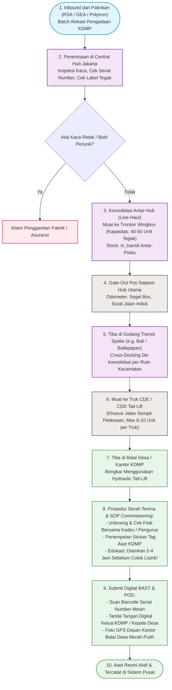
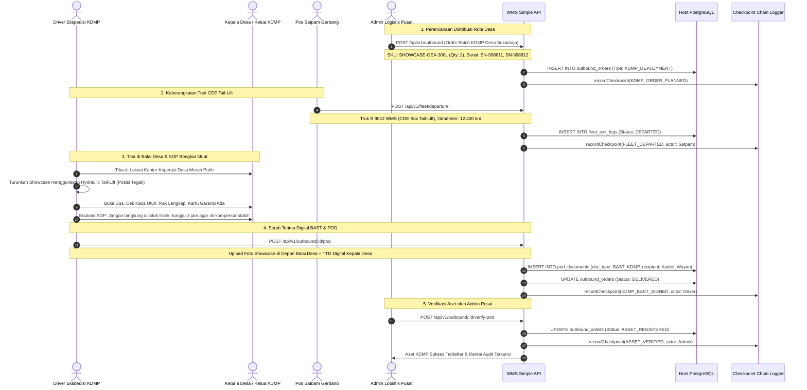

# 10_KDMP_Showcase_and_Chiller_Logistics.md

**Document:** Logistics & Warehouse Handling Specification for KDMP (Koperasi Desa/Kelurahan Merah Putih)  
**Commodity Focus:** Commercial Display Showcases, Chest Freezers, Food Chillers, & Cold Chain Infrastructure  
**Version:** 2.3.0  
**Status:** APPROVED STRATEGIC SPECIFICATION  

---

## 1. Analisis Konteks: Apa, Siapa, Mengapa, dan Bagaimana KDMP

### 1.1 Apa itu KDMP (Koperasi Desa/Kelurahan Merah Putih)?
**Koperasi Desa/Kelurahan Merah Putih (KDMP / KDKMP)** adalah program strategis nasional pemerintah Indonesia (era Presiden Prabowo Subianto) yang menargetkan pembentukan dan revitalisasi koperasi multiusaha di lebih dari **70.000 desa dan kelurahan di seluruh Indonesia**.

KDMP bertindak sebagai **pusat distribusi kebutuhan pokok (sembako)** sekaligus **penyerap hasil panen (off-taker)** petani, peternak ayam/sapi, dan nelayan lokal. KDMP juga menjadi simpul penyedia bahan baku bagi program nasional **Makan Bergizi Gratis (MBG)**.

### 1.2 Siapa Aktor yang Terlibat (Stakeholders Matrix)?
1. **Regulator & Pengarah:** Kementerian Koperasi, Bapanas (Badan Pangan Nasional), Kementerian Koordinator Bidang Pangan, Kementerian Desa.
2. **Holding BUMN & Pemasok:** ID FOOD (Holding BUMN Pangan), Perum BULOG, Pabrikan Elektronik Pendingin (RSA, GEA, Sanden, Panasonic, Polytron, Modena).
3. **Penyedia Logistik & WMS (3PL & Ekspedisi Trucking):** Mengelola staging barang di gudang utama, pengangkutan antar-pulau/antar-hub, dan *last-mile delivery* hingga ke balai desa.
4. **Penerima Lapangan (Consignee):** Pengurus KDMP, Kepala Desa/Lurah (*ex-officio* pengawas), Komite Logistik Desa.

### 1.3 Mengapa Butuh Showcase & Chiller di Tingkat Desa?
- **Menekan Kerusakan Pascapanen (*Post-Harvest Food Loss*):** Tanpa pendingin, produk hewani (daging ayam, sapi, ikan segar) dan susu cepat membusuk di iklim tropis desa.
- **Penyimpanan Bahan Baku Program MBG:** Menjaga pasokan protein beku tetap higienis dan segar sebelum diolah di dapur sentral gizi desa.
- **Memotong Rantai Tengkulak:** Koperasi dapat menampung ikan dan daging dari nelayan/peternak dengan harga stabil karena memiliki fasilitas penyimpanan beku (*cold chain*).

---

## 2. Karakteristik Fisik Kargo & Batasan Penanganan Khusus (*Handling Constraints*)

Showcase dan Chiller komersial **BUKAN** kargo general biasa; barang ini tergolong **Heavy Fragile Appliance with Sensitive Refrigeration System**.

```
┌─────────────────────────────────────────────────────────────┐
│          ATURAN EMAS PENANGANAN SHOWCASE & CHILLER          │
├─────────────────────────────────────────────────────────────┤
│ 1. ⬆️ WAJIB TEGAK (UPRIGHT ONLY): Dilarang dimiringkan > 45° │
│    agar oli kompresor tidak mengalir ke pipa evaporator.    │
│ 2. 🚫 DILARANG TUMPUK (NO DOUBLE STACKING) kecuali pallet   │
│    pabrikan dengan sangkar kayu struktural (wooden crate).  │
│ 3. 🔍 SERIAL NUMBER & IMEI TRACKING: Setiap unit memiliki   │
│    barcode Serial Number unik untuk garansi dan aset BMN.   │
│ 4. ⏳ RESTING TIME 2-4 JAM: Wajib diistirahatkan sebelum     │
│    dicolok ke listrik saat instalasi di balai desa.         │
│ 5. 🚛 TRUK TAIL-LIFT (LIFTGATE): Wajib armada dengan lift   │
│    hidrolik untuk bongkar muat aman di lokasi tanpa dock.   │
└─────────────────────────────────────────────────────────────┘
```

### 2.1 Matriks Tipe Unit Showcase & Chiller KDMP

| Kategori Unit | Dimensi Fisik (P x L x T cm) | Berat Bersih | Suhu Kerja | Unit Kemasan | Syarat Armada Khusus |
|---|---|---|---|---|---|
| **Display Showcase 1-Pintu (250L - 350L)** | 55 x 58 x 170 | 55 – 65 KG | +2°C s/d +8°C | Dus + Styrofoam + Pallet Kayu | CDE / CDD Box Tertutup |
| **Display Showcase 2-Pintu (800L - 1000L)**| 110 x 68 x 200 | 110 – 135 KG | +2°C s/d +8°C | Wooden Crate Heavy Duty | CDD / Fuso Box Tail-Lift |
| **Chest Freezer Protein Daging/Ikan (300L - 500L)** | 130 x 70 x 85 | 60 – 80 KG | -18°C s/d -25°C | Dus + Base Wood Skid | CDE / CDD Box |
| **Upright Bio-Chiller Vaksin & Susu Segar** | 60 x 65 x 185 | 75 – 90 KG | +2°C s/d +6°C | Full Foam + Wooden Frame | CDD Box Shock Absorber |

---

## 3. Penyesuaian Master Data & Skema Database WMS Simple

Untuk mendukung pengiriman Showcase KDMP tanpa mengubah arsitektur inti, ditambahkan master lookup baru:

### 3.1 Penambahan Master Cargo Type & Handling Code
```sql
-- 1. Kategori Kargo Khusus
INSERT INTO master_cargo_types (id, code, name, description, requires_temperature_control, max_stacking_layers, handling_instructions)
VALUES 
('c0000000-0000-0000-0000-000000000004', 'APPLIANCE_COLD_CHAIN', 'Commercial Chiller & Showcase', 'Peralatan pendingin komersial showcase dan chest freezer KDMP', false, 1, 'WAJIB TEGAK (UPRIGHT ONLY), JANGAN DIBANTING, HINDARI BENTURAN KACA, BONGKAR DENGAN TAIL-LIFT');

-- 2. Tipe Dokumen BAST KDMP
INSERT INTO master_document_types (id, code, name, category, is_legal_compliance)
VALUES
('d0000000-0000-0000-0000-000000000005', 'BAST_KDMP', 'Berita Acara Serah Terima KDMP', 'OUTBOUND_POD', true);
```

### 3.2 Pelacakan Nomor Seri Mesin (*Unit Serial Number Tracking*)
Pada level `outbound_items` dan `packages`, setiap unit showcase mencatat:
- `serial_number`: Nomor seri unik kompresor/unit (misal: `RSA-CF300-20260901-0889`).
- `brand_model`: Merk dan tipe (misal: `GEA EXPO-37FA / RSA CF-310`).
- `asset_tag_kdmp`: Nomor register aset Koperasi Desa (misal: `KDMP-BALI-DPS-0012`).

---

## 4. Diagram Alur Distribusi Logistik Showcase & Chiller KDMP (Flowchart)



---

## 5. Diagram Sequence Alur Distribusi Showcase ke Balai Desa KDMP



---

## 6. Checklist SOP Pengemudi & Teknisi Serah Terima KDMP

1. **Pemeriksaan Kemiringan Selama Pengiriman:**
   - Pastikan *lashing strap* terikat kencang pada dinding box truk sehingga showcase tidak bergeser atau miring saat melewati jalanan desa bergelombang.
2. **Uji Nyala Setelah *Resting Time*:**
   - Setelah didiamkan minimal 2–4 jam, unit dapat dicolokkan ke sumber listrik stabil (220V) untuk memastikan kipas berputar dan kompresor mulai mendinginkan.
3. **Penyimpanan Berkas Fisik & Digital:**
   - Buku petunjuk dan kartu garansi diserahkan langsung ke bendahara/pengurus KDMP.
   - Foto bukti BAST wajib memperlihatkan papan nama resmi *"Koperasi Desa Merah Putih"* di latar belakang.
